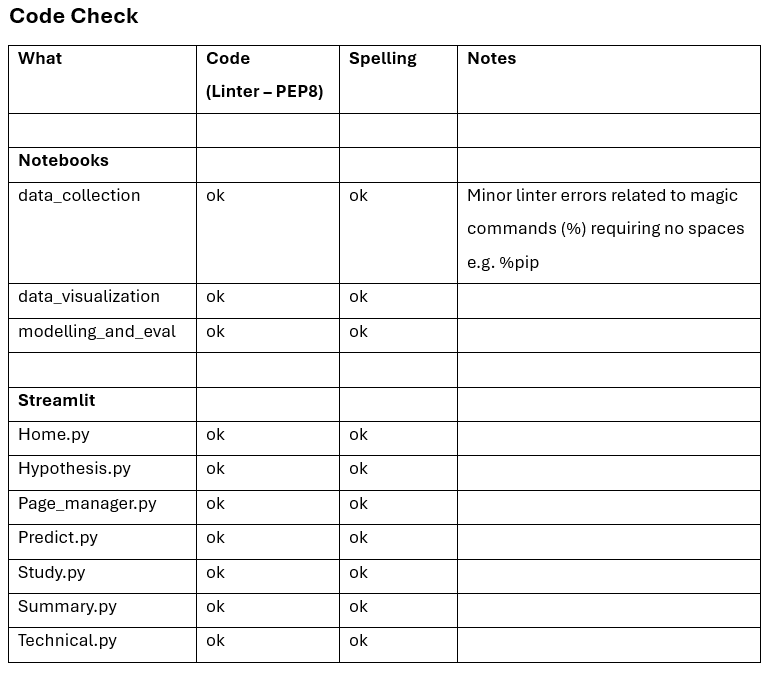
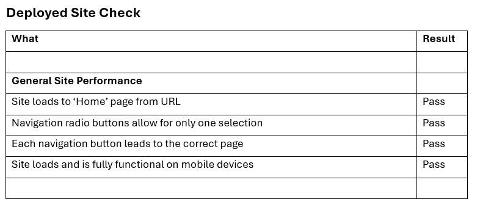
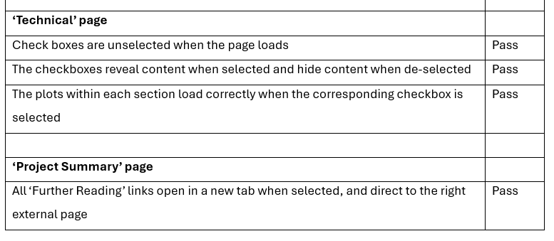

# mildew_detector

## Intro

Include:
- mockup
- links to site
- links to kanban board

## Business Requirements

The cherry plantation crop from Farmy & Foods is facing a challenge where their cherry plantations have been presenting powdery mildew. Currently, the process is manual verification if a given cherry tree contains powdery mildew. An employee spends around 30 minutes in each tree, taking a few samples of tree leaves and verifying visually if the leaf tree is healthy or has powdery mildew. If there is powdery mildew, the employee applies a specific compound to kill the fungus. The time spent applying this compound is 1 minute. The company has thousands of cherry trees located on multiple farms across the country. As a result, this manual process is not scalable due to the time spent in the manual process inspection.

To save time in this process, the IT team suggested an ML system that detects instantly, using a leaf tree image, if it is healthy or has powdery mildew. A similar manual process is in place for other crops for detecting pests, and if this initiative is successful, there is a realistic chance to replicate this project for all other crops. The dataset is a collection of cherry leaf images provided by Farmy & Foods, taken from their crops.

- 1 - The client is interested in conducting a study to visually differentiate a healthy cherry leaf from one with powdery mildew.
- 2 - The client is interested in predicting if a cherry leaf is healthy or contains powdery mildew.

Credit Code Institute 'Milestone Project Mildew Detection in Cherry Leaves' template for text.

## Hypothesis

### Hypothesis

Pre-project, it was defined that:

- The detection of powdery mildew in cherry leaves currently relies on manual inspection. 
- It is our hypothesis that a machine learning model, trained on images of cherry leaves, could accurately differentiate between images of healthy leaves and those affected by powdery mildew. 
- This model could then allow for earlier and faster mildew detection.

### Validation

Pre-project it was defined that:

- The model’s accuracy in detecting powdery mildew will evaluated using a labelled test dataset. 
- If the model's accuracy passes 97% (client's stated target), it will be considered a viable replacement for manual leaf inspection.

### Conclusion
The model was evaluated using a set of unseen test data, split into 106 batches. Post-evaluation it was found that:

- The saved evaluation returned an accuracy of 0.9965 and a loss of 0.0877. Both metrics were in line with the validation figures observed during model fitting.
- The evaluation shows that the model exceeds the client's requirement of 97% accuracy and is well-suited for deployment.
- The client's hypothesis has proven valid and this model can be confidently deployed to replace manual inspection of cherry leaves.

## Rationale to map the business requirements to the Data Visualizations and ML tasks

### Business Requirement 1: Data Visualization

- We will display the "mean" and "standard deviation" images for healthy cherry leaves and those with mildew.
- We will display the difference between an average healthy cherry leaf and those with mildew.
- We will display an image montage for healthy cherry leaves and those with mildew.

### Business Requirement 2: Classification

- We would like to predict whether a given leaf is healthy or shows signs of mildew
- We would like to build a binary classifier and generate reports for download.

## ML Business Case Assessment

### Business Case Requirements

- The client is interested in conducting a study to visually differentiate a cherry leaf that is healthy from one that contains powdery mildew. The study should include analysis on:
  - average images and variability images for each class (healthy or powdery mildew),
  - the differences between average healthy and average powdery mildew cherry leaves,
  - an image montage for each class.
- The client is interested in predicting if a cherry leaf is healthy or contains powdery mildew.

### Conventional Data Analysis

- We can use conventional data analysis to conduct a study to visually differentiate a cherry leaf that is healthy from one that contains powdery mildew.

### API or Dashboard

- The client needs a dashboard.

### Successful Project Outcome

- A study showing how to visually differentiate a cherry leaf that is healthy from one that contains powdery mildew.
- Also, the capability to predict if a cherry leaf is healthy or contains powdery mildew.

### Epics

- Information gathering and data collection.
- Data visualization, cleaning, and preparation.
- Model training, optimization and validation.
- Dashboard planning, designing, and development.
- Dashboard deployment and release.

### Ethical or Privacy Concerns

- The client provided the data under an NDA (non-disclosure agreement), therefore the data should only be shared with professionals that are officially involved in the project.

### Suggested ML Model

- The data suggests a binary classifier, indicating whether a particular cherry leaf is healthy or contains powdery mildew.

### Performance Goal

- We agreed with the client a degree of 97% accuracy.

### Benefit Statement

- The client will not supply the market with a product of compromised quality.

Credit Code Institute Mildew Detection in Cherry Leaves Handbook for Business Case Assessment text.

## Dataset Content

- The dataset is sourced from [Kaggle](https://www.kaggle.com/codeinstitute/cherry-leaves). We then created a fictitious user story where predictive analytics can be applied in a real project in the workplace.
- The dataset contains +4 thousand images taken from the client's crop fields. The images show healthy cherry leaves and cherry leaves that have powdery mildew, a fungal disease that affects many plant species. The cherry plantation crop is one of the finest products in their portfolio, and the company is concerned about supplying the market with a compromised quality product.

Credit Code Institute 'Milestone Project Mildew Detection in Cherry Leaves' template for text.

## Dashboard Design

The dashboard was designed to be deployed using Streamlit and contain the following pages:

### Home

A brief welcome to the site which includes:

- Dashboard name
- Introduction statement
- Reference to navigation
- Closing statement

### Project Summary

Provide an overview of the project, including:

- Description of the project background and why it is necessary
- Define the project dataset
- Identify the business requirements
- Provide links to further reading

### Hypothesis

Including:

- A statement of the project's hypothesis
- A statement of how the hypothesis will be validated
- A conclusion

### Data Visualization

A page to address business requirement 1, enabling the user to see:

- The "mean" and "standard deviation" images for healthy cherry leaves and those with mildew
- The difference between an average healthy cherry leaf and those with mildew
- An image montage for healthy cherry leaves and those with mildew

### Prediction

A page to address business requirement 2, enabling the user to:

- Download a set on images from Kaggle to use with model
- Upload multiple images for predictions on leaf health
- See the results of the prediction displayed in a dataframe
- Download the results is a .csv file

### Technical

A page to enable people with a technical interest in the project to see:

- The number of images used in the ML pipeline
- The accuracy and loss values generated during the training epochs
- The results of model evaluation

## ML Pipeline

## The Model

The machine learning model for this project is a sequential convolutional neural network designed to learn to differentiate between healthy and mildewed cherry leaves. The model comprises the following layers:

### Convolution
 
- The images are passed through three Convolution layers. These layers identify patterns within the images. The filters in these layers grow from 32 to 64 to 128 consecutively, helping the model to progressively increase the depth of feature extraction.
 
- Each Convolution layer is followed by MaxPooling, which reduces the spatial complexity of the image while retaining key features. This helps to streamline computation and prevent the model from overfitting.

### Flatten

- The Flatten layer converts the multi-dimensional feature maps from the convolutional and MaxPooling layers (2D in this model) into a single-dimensional array, which is required by the Dense layer.

### Dense and Dropout

- The Dense layer is responsible for establishing meaningful relationships between the extracted patterns. In this model, the first Dense layer includes L2 regularization.

- The Dropout layer randomly deactivates neurons in the network. This encourages distributed learning across multiple pathways by avoiding an overreliance on any one given neuron.

- Finally, the output Dense layer employs a sigmoid activation function, which produces a probability score of between 0 and 1 for a given image. This allows the model to classify whether an image belongs to a healthy or mildewed category.

### Compiler

The Compiler is then used to tell the model how to: 
- measure errors – (binary-crossentropy) – used in binary classification tasks
- evaluate performance – (accuracy) – a suitable metric that is easy to map to the client’s accuracy requirement
- optimize the weights – (Adam) – smooth and efficient optimizer for deep learning

### Adjustments

The Dense and Dropout layers were those that I adjusted in this project as I sought to find the best fit for the model. I focused on adding and then adjusting a regularizer within the first Dense layer to discourage an overreliance on large weights and, hopefully, prevent overfitting. I also experimented with adjusting the Dropout values to change the model’s reliance on specific neurons within the model.

After some trial and error with these parameters, and in conjunction with experimentations on batch size and the number of steps, I think that this model returns the best fit given: 
- the client’s accuracy requirements
- efficiency and performance, given my processing power, 
- file size (38.77MB), given deployment constraints. 

## Testing

The code and deployed app were tested using a mixture of CI Python Linter (PEP8) and manual checks. The results are shown below.

CI Python Linter

Manual App Check

## Bugs

There are no unfixed bugs.

## Deployment

## Libraries

## Credits

## Acknowledgments

