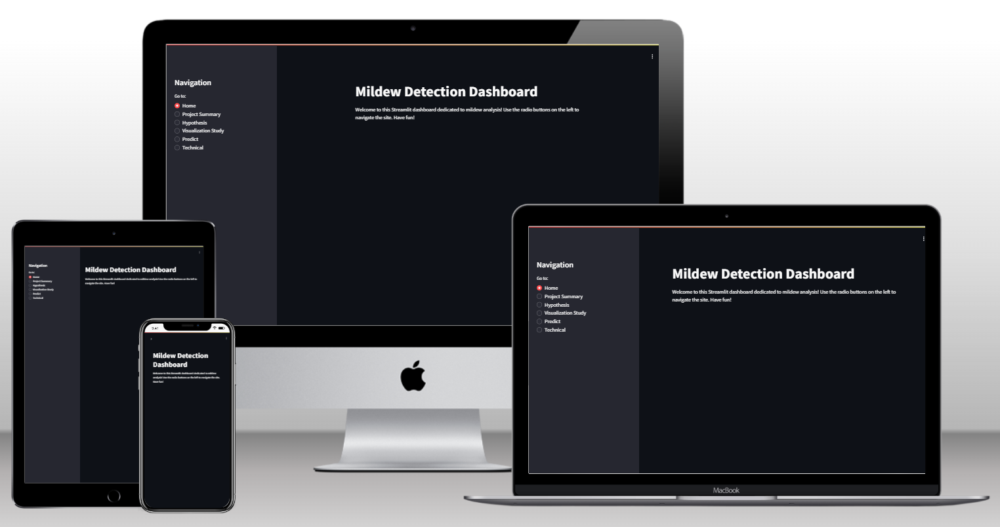
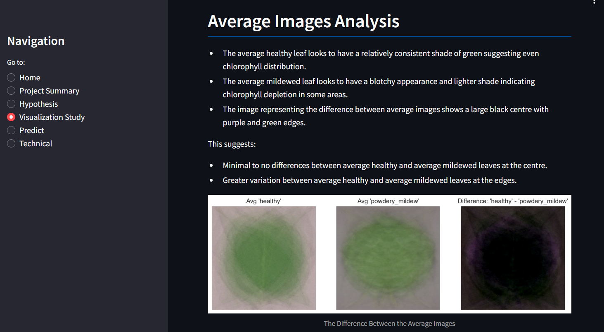
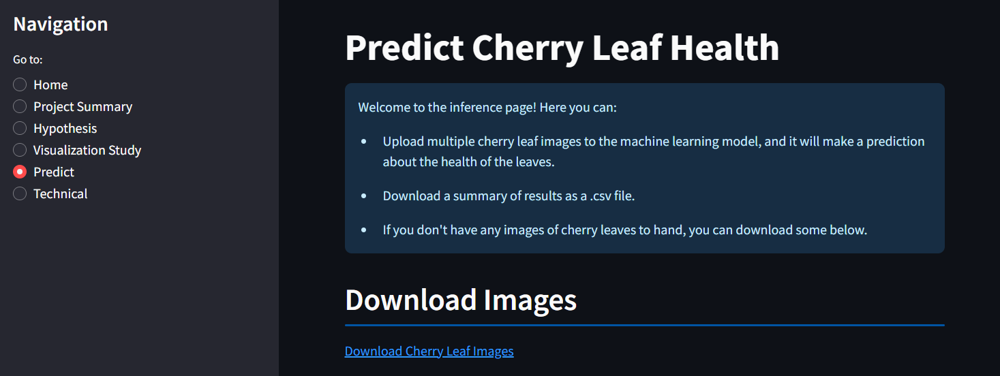
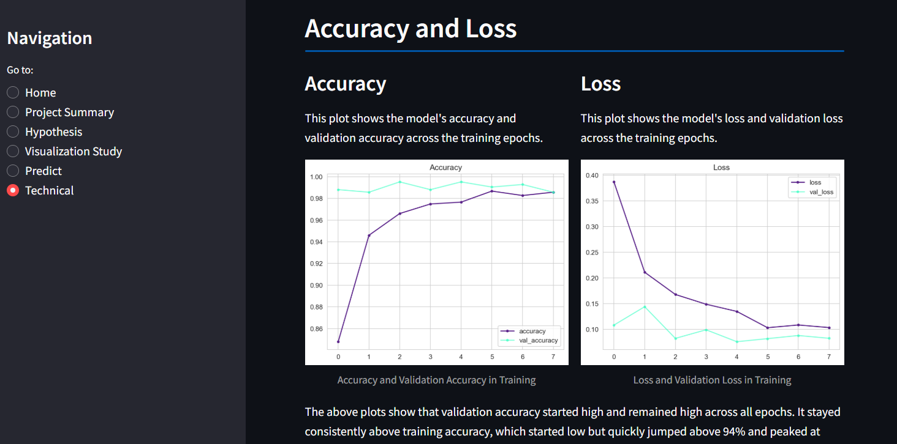
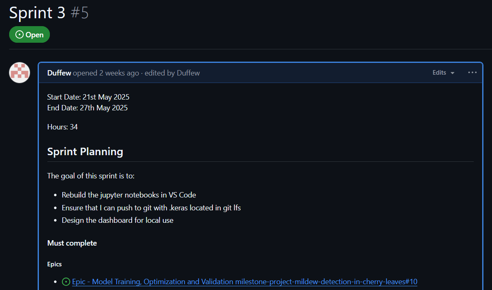
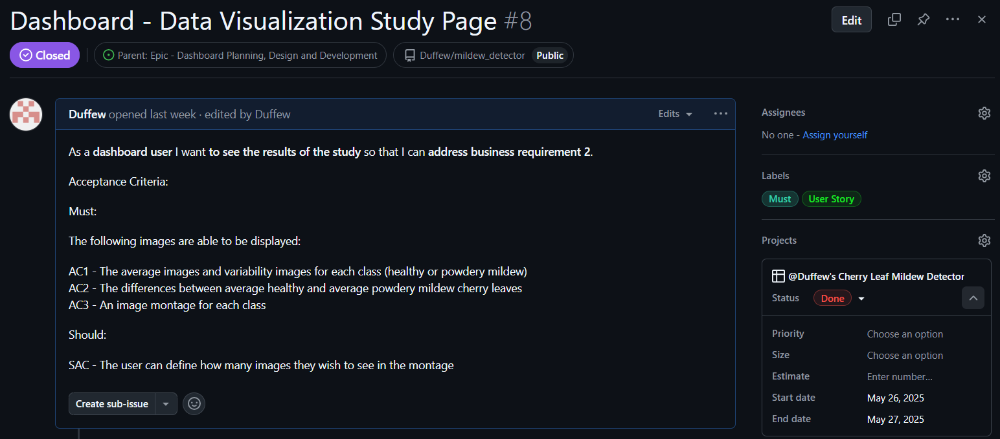
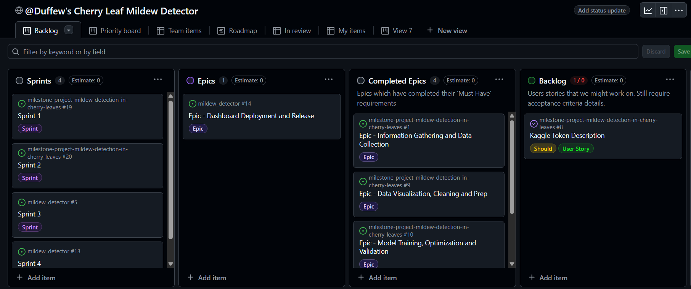
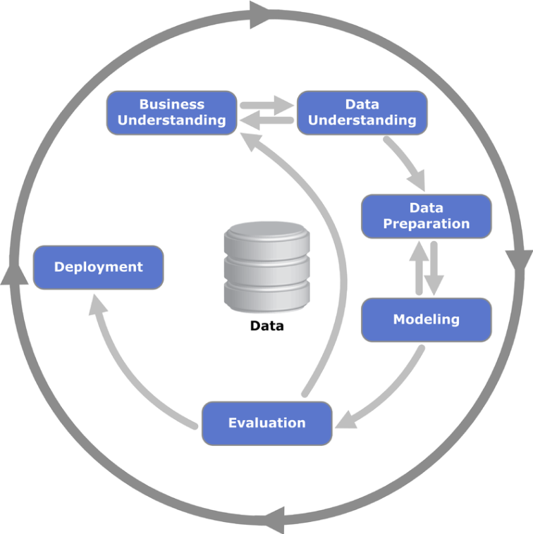
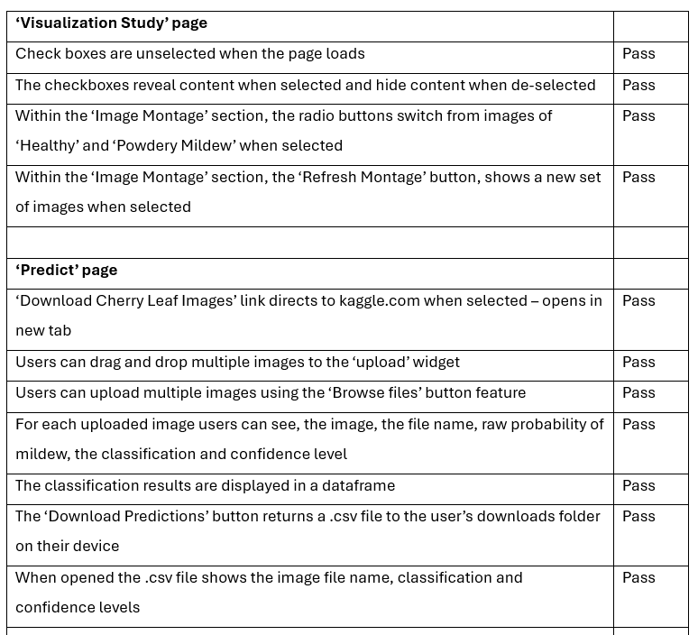

# The Mildew Detector

The Mildew Detector is a Streamlit dashboard developed as part of a machine learning project.

The project centres around developing a machine learning model, trained to detect powdery mildew in cherry leaves.

The dashboard enables users to upload images of cherry leaves and receive an assessment of whether the leaf shows signs of infection with powdery mildew.

The dashboard is fully responsive for a range of devices.

The deployed site can be viewed [here](https://duffew-mildew-detector-2211e09058e6.herokuapp.com/).

## Features

### Home Page

The home page features the name of the dashboard and a brief welcome message directing users to the navigation pane.

### Project Summary Page

This page provides:
- background information on the project
- details of the dataset
- a brief outline of the business requirements
- links to further reading

### Hypothesis Page

This page provides:

- An hypothesis statement
- A validation statement
- A conclusion statement

### Data Visualisation Page

This page provides information relating to data visualisations including:

- Variability images analysis
- Average images analysis
- Image montage

### Predict Page

This page enables users:

- Download a set of images
- Upload images for analysis
- Download results in a .csv file

### Technical Page

This page enables users with a technical interest to see metrics related to:

- The number and sets of images used
- Loss and accuracy measurements from training
- The post-training evaluation results

## Development

### Agile

The project was delivered in accordance with agile principles for managing work, making use of Sprints, User Stories, a project board visual and an iterative and incremental approach to delivering requirements.

#### Sprints

The work of this project was delivered across four Sprints. The chosen duration each being Sprint was one week. 

At the beginning of each Sprint, the work was planned by identifying the Epics to be addressed and decomposing those broad requirements into User Stories. These were then placed in the Product Backlog on the project board. The User Stories were prioritised as either 'Must', 'Should' or 'Could' be delivered within the Sprint.

At the conclusion of the Sprint, the work was reviewed and the number of User Stories moved to the 'Done' column was counted. The state of the project board was recorded and then the work of the next Sprint planned.

[Sprint 3 Example](https://github.com/Duffew/mildew_detector/issues/5#issue-3079827271)

#### User Stories

User Stories were used to define requirements at a detailed level and focus the work of the Sprints. Epics were used at the beginning of the project, to break the requirements into large blocks, and these were then decomposed into the User Stories as part of Sprint planning. As the User Stories were created, they were given a project level priority for delivery (Must Should or Could).

The User Stories followed the standard template of:

"As a [role] I want to [feature] so that [benefit]", with a sets of Acceptance Criteria categorised as 'Must have', 'Should have' and 'Could have' requirements.

These Acceptance Criteria were then used to assess whether the requirements of the  User Story had been delivered, and could be moved to the 'Done' column on the project board.

*A User Story with a 'Must' deliver project label and 'Must have' and 'Should have' Acceptance Criteria for the requirement.*

[User Story Example](https://github.com/Duffew/mildew_detector/issues/8#issue-3089325338)

#### Project Board

A project board was used to provide a visual representation of Work In Progress (WIP). The board contained and tracked information relating to Sprints, Epics and User Stories, which were placed in defined columns. The columns included, in order:

- Sprints - Sprints were added to this column week-by-week and not moved.
- Epics - All Epics begin in this column when first created
- Completed Epics - Show Epics that satisfy their 'Must have' Acceptance Criteria.
- Backlog - All User Stories appear in this column when first created. The requirement is defined but specific Acceptance Criteria may not be at this point. Unfinished User Stories from a Sprint are also returned here.
- Ready - These are User Stories that now have prioritised Acceptance Criteria defined and are planned to be delivered within this Sprint. This column has a WIP limit of 5 to prevent planning too many User Stories in detail at the start of the Sprint.
- In progress - These show the User Stories that are actively being worked on in the moment. This column has a WIP limit of 3. This helps to group together small amounts of work around a common theme and prevent loss of focus by task switching between too many disparate requirements.
- In review - User Stories here are waiting to be checked for completion. This column has a WIP limit of 5. This helps the review activity to become a more formalised procedure where larger numbers of User Stories can be checked together and dependencies between requirements confirmed.
- Done - At a minimum, all of the 'Must have' Acceptance Criteria have been delivered.

[The Project Board](https://github.com/users/Duffew/projects/10)

[The Roadmap](https://github.com/users/Duffew/projects/10/views/4)

### CRISP-DM Workflow

The project followed the Cross Industry Standard Process for Data Mining (CRISP-DM) workflow from start to finish. The steps within CRISP-DM are as follows:

- Business understanding - the business requirements were defined before any other work began and revisited after evaluation a number of times to understand whether we had a good model
- Data understanding - the data was available from kaggle.com
- Data preparation - Machine Learning (ML) Pipeline Tasks 1 and 2
  + The data was collected from kaggle.com
  + The data was split into train, test, and validation sets
  + The data was cleaned by checking to ensure that it only included images
  + The data was augmented in preparation for modelling
- Modelling - ML Pipeline Task 3
  + The model was developed and redeveloped a number of times based upon evaluation against business requirements
- Evaluation - ML Pipeline Task 3
  + The model was evaluated for accuracy against an unseen test set of images and compared to the client's business requirements
- Deployment - ML Pipeline Task 4
  + Once Modelling produced a model that satisfied the client's business requirements, the model was deployed to the Streamlit app for inference

  

  *The CRISP-DM Workflow*

## Business Requirements

The cherry plantation crop from Farmy & Foods is facing a challenge where their cherry plantations have been presenting powdery mildew. Currently, the process is manual verification if a given cherry tree contains powdery mildew. An employee spends around 30 minutes in each tree, taking a few samples of tree leaves and verifying visually if the leaf tree is healthy or has powdery mildew. If there is powdery mildew, the employee applies a specific compound to kill the fungus. The time spent applying this compound is 1 minute. The company has thousands of cherry trees located on multiple farms across the country. As a result, this manual process is not scalable due to the time spent in the manual process inspection.

To save time in this process, the IT team suggested an ML system that detects instantly, using a leaf tree image, if it is healthy or has powdery mildew. A similar manual process is in place for other crops for detecting pests, and if this initiative is successful, there is a realistic chance to replicate this project for all other crops. The dataset is a collection of cherry leaf images provided by Farmy & Foods, taken from their crops.

- 1 - The client is interested in conducting a study to visually differentiate a healthy cherry leaf from one with powdery mildew.
- 2 - The client is interested in predicting if a cherry leaf is healthy or contains powdery mildew.

Credit Code Institute 'Milestone Project Mildew Detection in Cherry Leaves' template for text.

## Hypothesis

### Hypothesis

Pre-project, it was defined that:

- The detection of powdery mildew in cherry leaves currently relies on manual inspection. 
- It is our hypothesis that a machine learning model, trained on images of cherry leaves, could accurately differentiate between images of healthy leaves and those affected by powdery mildew. 
- This model could then allow for earlier and faster mildew detection.

### Validation

Pre-project it was defined that:

- The model’s accuracy in detecting powdery mildew will evaluated using a labelled test dataset. 
- If the model's accuracy passes 97% (client's stated target), it will be considered a viable replacement for manual leaf inspection.

### Conclusion
The model was evaluated using a set of unseen test data, split into 106 batches. Post-evaluation it was found that:

- The saved evaluation returned an accuracy of 0.9965 and a loss of 0.0877. Both metrics were in line with the validation figures observed during model fitting.
- The evaluation shows that the model exceeds the client's requirement of 97% accuracy and is well-suited for deployment.
- The client's hypothesis has proven valid and this model can be confidently deployed to replace manual inspection of cherry leaves.

## Rationale to map the business requirements to the Data Visualizations and ML tasks

### Business Requirement 1: Data Visualization

- We will display the "mean" and "standard deviation" images for healthy cherry leaves and those with mildew.
- We will display the difference between an average healthy cherry leaf and those with mildew.
- We will display an image montage for healthy cherry leaves and those with mildew.

### Business Requirement 2: Classification

- We would like to predict whether a given leaf is healthy or shows signs of mildew
- We would like to build a binary classifier and generate reports for download.

## ML Business Case Assessment

### Business Case Requirements

- The client is interested in conducting a study to visually differentiate a cherry leaf that is healthy from one that contains powdery mildew. The study should include analysis on:
  - average images and variability images for each class (healthy or powdery mildew),
  - the differences between average healthy and average powdery mildew cherry leaves,
  - an image montage for each class.
- The client is interested in predicting if a cherry leaf is healthy or contains powdery mildew.

### Conventional Data Analysis

- We can use conventional data analysis to conduct a study to visually differentiate a cherry leaf that is healthy from one that contains powdery mildew.

### API or Dashboard

- The client needs a dashboard.

### Successful Project Outcome

- A study showing how to visually differentiate a cherry leaf that is healthy from one that contains powdery mildew.
- Also, the capability to predict if a cherry leaf is healthy or contains powdery mildew.

### Epics

- Information gathering and data collection.
- Data visualization, cleaning, and preparation.
- Model training, optimization and validation.
- Dashboard planning, designing, and development.
- Dashboard deployment and release.

### Ethical or Privacy Concerns

- The client provided the data under an NDA (non-disclosure agreement), therefore the data should only be shared with professionals that are officially involved in the project.

### Suggested ML Model

- The data suggests a binary classifier, indicating whether a particular cherry leaf is healthy or contains powdery mildew.

### Performance Goal

- We agreed with the client a degree of 97% accuracy.

### Benefit Statement

- The client will not supply the market with a product of compromised quality.

Credit Code Institute Mildew Detection in Cherry Leaves Handbook for Business Case Assessment text.

## Dataset Content

- The dataset is sourced from [Kaggle](https://www.kaggle.com/codeinstitute/cherry-leaves). We then created a fictitious user story where predictive analytics can be applied in a real project in the workplace.
- The dataset contains +4 thousand images taken from the client's crop fields. The images show healthy cherry leaves and cherry leaves that have powdery mildew, a fungal disease that affects many plant species. The cherry plantation crop is one of the finest products in their portfolio, and the company is concerned about supplying the market with a compromised quality product.

Credit Code Institute 'Milestone Project Mildew Detection in Cherry Leaves' template for text.

## Dashboard Design

The dashboard was designed to be deployed using Streamlit and contain the following pages:

### Home

A brief welcome to the site which includes:

- Dashboard name
- Introduction statement
- Reference to navigation
- Closing statement

### Project Summary

Provide an overview of the project, including:

- Description of the project background and why it is necessary
- Define the project dataset
- Identify the business requirements
- Provide links to further reading

### Hypothesis

Including:

- A statement of the project's hypothesis
- A statement of how the hypothesis will be validated
- A conclusion

### Data Visualization

A page to address business requirement 1, enabling the user to see:

- The "mean" and "standard deviation" images for healthy cherry leaves and those with mildew
- The difference between an average healthy cherry leaf and those with mildew
- An image montage for healthy cherry leaves and those with mildew

### Prediction

A page to address business requirement 2, enabling the user to:

- Download a set on images from Kaggle to use with model
- Upload multiple images for predictions on leaf health
- See the results of the prediction displayed in a dataframe
- Download the results is a .csv file

### Technical

A page to enable people with a technical interest in the project to see:

- The number of images used in the ML pipeline
- The accuracy and loss values generated during the training epochs
- The results of model evaluation

## The Model

The machine learning model for this project is a sequential convolutional neural network designed to perform a binary classification task -  to learn to differentiate between healthy and mildewed cherry leaves. The model comprises the following layers:

### Convolution
 
- The images are passed through three Convolution layers. These layers identify patterns within the images. The filters in these layers grow from 32 to 64 to 128 consecutively, helping the model to progressively increase the depth of feature extraction.
 
- Each Convolution layer is followed by MaxPooling, which reduces the spatial complexity of the image while retaining key features. This helps to streamline computation and prevent the model from overfitting.

### Flatten

- The Flatten layer converts the multi-dimensional feature maps from the convolutional and MaxPooling layers (2D in this model) into a single-dimensional array, which is required by the Dense layer.

### Dense and Dropout

- The Dense layer is responsible for establishing meaningful relationships between the extracted patterns. In this model, the first Dense layer includes L2 regularization.

- The Dropout layer randomly deactivates neurons in the network. This encourages distributed learning across multiple pathways by avoiding an overreliance on any one given neuron.

- Finally, the output Dense layer employs a sigmoid activation function, which produces a probability score of between 0 and 1 for a given image. This allows the model to classify whether an image belongs to a healthy or mildewed category.

### Compiler

The Compiler is then used to tell the model how to: 
- measure errors – (binary-crossentropy) – used in binary classification tasks
- evaluate performance – (accuracy) – a suitable evaluation metric that is easy to map to the client’s accuracy requirement
- optimize the weights – (Adam) – smooth and efficient optimizer for deep learning

### Adjustments

Within the model itself, the Dense and Dropout layers were those that I adjusted the most as I sought to find the best fit. I focused on adding and then adjusting a regularizer within the first Dense layer to discourage an overreliance on large weights and, hopefully, prevent overfitting. I also experimented with adjusting the Dropout values to change the model’s reliance on specific neurons within the model. These adjustments were primarily in response to valuation accuracy hitting 1.00 across a large number of epochs (suggesting memorisation of features rather than generalisation about them).

At the Convolution layer, I experimented with different numbers of filters (32, 64, 64 for example) as I tried to balance the model’s accuracy with my processing power. I also e

Outside the model, I experimented with batch sizing, limiting steps per epoch and adjusting the image shape. These adjustments were in response to issues such as kernel panics, running out of images to process within epochs, overall processing speed and some huge models (at least one ended up being close to 800MB!).

After some trial and error with the above parameters, I think that the deployed model returns the best fit given:

- the client’s accuracy requirements
- my computer's processing power
- deployment constraints - this model is only 38.77MB

## Testing

The code and deployed app were tested using a mixture of CI Python Linter (PEP8) and manual checks. The results are shown below.

CI Python Linter

Manual App Check

## Bugs

There are no unfixed bugs.

## Deployment

## Main Data Analysis and Machine Learning Libraries

### Libraries

- Matplotlib - used for creating plots within the notebooks and Streamlit app 
    + For example: matplotib was used to create the plot avg_var_healthy.png within the data_visualization notebook
- Joblib - used to process and save computational output to .pkl files 
  + For example: Joblib was used to store the average image shape in image_shape.pkl within the data_visualization notebook
- NumPy - used to help manage mathematical computations, particularly multi-dimensional arrays
  + For example: NumPy was used to convert lists to NumPy arrays for statistical analysis within the load_image_as_array() function, within the data_visualization notebook
- Pandas - used for data manipulation and analysis
  + For example: Pandas was used to generate a dataframe for displaying inference results in the predict.py Streamlit app
- Seaborn - used on top of Matplotlib to easily format and style plots
  + For example: Seaborn was used to help display the image shape as a scatterplot with a white-grid style within the data_visualization notebook

### Frameworks

- Streamlit - a Python framework used in this project to quickly build and deploy the project dashboard
- Tensorflow-cpu - used to build and deploy the deep learning model in this project - the cpu variant is designed to be a more lightweight solution than Tensorflow-gpu

### APIs

- Keras - used to assist Tensorflow in the building and then training of the convolutional neural network developed in this project - as an API it provided readymade solutions for such machine learning processes as backpropagation, matrix operations and optimizations in this project's ML model

### Other Resources

- AI - Copilot was used to help with:
  + Assessing training data and developing strategies for adjusting the training model
  + Debugging and troubleshooting - copying and pasting code to help find errors
  + Proofreading
  + Q&A - general questions about code structure, which libraries or particular modules might be of use, and how to manage the IDE

## Credits

- Code and text from Code Institute's walkthrough projects and Cherry Leaf Mildew Handbook have been used and acknowledged directly within the relevant files.

## Acknowledgments

- My mentor Spencer Barriball, as always, for advice, guidance, troubleshooting and firefighting. Thanks Spence!

